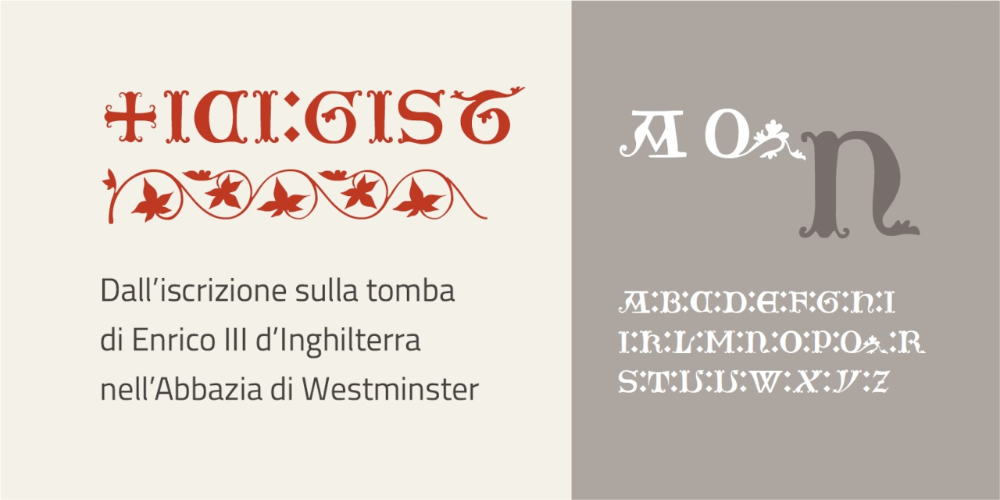

# Ici Gist
- Versione 1.101: fix esportazione
- Versione 1.0: versione iniziale

Per testare il font, vedere la [pagina interattiva](https://m-casanova.github.io/IciGist/).

## Descrizione

Il font **Ici Gist** è basato sui caratteri presenti sulla tomba di Enrico III d'Inghilterra, come riportati da una [raccolta del 1850 circa](https://archive.org/details/illuminatediniti00unse/page/n70/mode/1up).

Sono presenti varianti per le lettere _A D T U V Z_, accessibili tramite caratteristica '**ss01**'; il trattino - permette di avere una decorazione.
